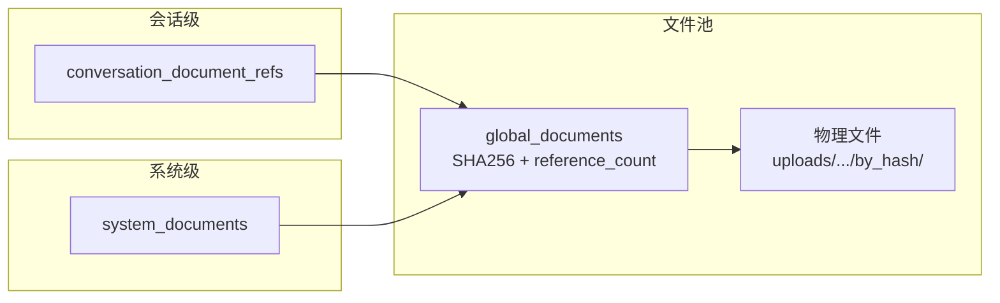

# 数据库文档

## 一、表清单

### 基础表（schema.sql）

| # | 表名 | 说明 |
| :--- | :--- | :--- |
| 1 | `users` | 用户 |
| 2 | `login_history` | 登录历史 |
| 3 | `conversations` | 会话 |
| 4 | `messages` | 消息 |
| 5 | `chunks` | 文本块（RAG） |
| 6 | `global_documents` | 全局文档（SHA256 去重） |
| 7 | `conversation_document_refs` | 会话-文档关联 |
| 8 | `system_documents` | 系统级知识库文档 |
| 9 | `conversation_summaries` | 会话摘要缓存 |

---

## 二、数据关系图 (ERD)

```
┌───────────────────────────────┐
│           users               │
│───────────────────────────────│
│ id                (PK) INTEGER│
│ phone          (UNIQUE) TEXT  │
│ nickname                   TEXT│
│ created_at               INT  │
│ updated_at               INT  │
└─────────────┬─────────────────┘
              │
              │ 1
              │
              │ N
              ▼
┌───────────────────────────────────────────────────────┐
│                    conversations                      │
│───────────────────────────────────────────────────────│
│ id                         (PK) TEXT                 │
│ user_id                    (FK → users.id) INTEGER   │
│ title                                            TEXT │
│ status           DEFAULT 'active'                   TEXT│
│ initial_prompt                                    TEXT│
│ deleted_at                                        INT │
│ created_at                                       INT  │
│ updated_at                                       INT  │
└────┬──────────────────────┬─────────────────────┬─────┘
     │                      │                     │
     │ 1                    │ 1                   │ 1
     │                      │                     │
     │ N                    │ N                   │ N
     ▼                      ▼                     ▼
┌─────────────────┐ ┌─────────────────┐ ┌─────────────────┐
│    messages     │ │     chunks      │ │ conversation_   │
│─────────────────│ │─────────────────│ │ document_refs   │
│id (PK) INTEGER  │ │id (PK) INTEGER  │ │─────────────────│
│conversation_id  │ │conversation_id  │ │id (PK) INTEGER  │
│   (FK) TEXT     │ │   (FK) TEXT     │ │conversation_id  │
│role TEXT        │ │page_content TEXT│ │   TEXT          │
│content TEXT     │ │metadata TEXT    │ │global_doc_id    │
│reasoning TEXT   │ │source TEXT      │ │  (FK) INTEGER   │
│summarized INT   │ │chunk_index INT  │ │doc_type TEXT    │
│created_at INT   │ │doc_type TEXT    │ │version INT      │
└─────────────────┘ │scope TEXT       │ │local_name TEXT  │
                    │ref_category TEXT│ │content_snapshot │
                    │ref_id INT       │ │   TEXT          │
                    │deleted INT      │ │ref_category TEXT│
                    │created_at INT   │ │created_at INT   │
                    └─────────────────┘ └────────┬────────┘
                                                 │ FK (global_doc_id)
                                                 │
┌───────────────────────────────┐                │
│        login_history          │                ▼
│───────────────────────────────│ ┌───────────────────────────────┐
│ id                (PK) INTEGER│ │     global_documents           │
│ user_id            (FK) INT   │ │────────────────────────────────│
│ token                     TEXT│ │ id                (PK) INTEGER │
│ ip                       TEXT│ │ file_hash     (UNIQUE) TEXT   │
│ user_agent               TEXT│ │ file_path               TEXT   │
│ login_at                 INT │ │ original_name           TEXT   │
└─────────────┬─────────────────┘ │ file_type               TEXT   │
              │                   │ file_size               INT    │
              │ FK (user_id)      │ reference_count DEFAULT 1 INT │
                                  │ created_at              INT    │
┌───────────────────────────────┐ └───────────────────────────────┘
│      system_documents         │
│───────────────────────────────│
│ id                (PK) INTEGER│
│ global_doc_id      (FK) INT   │
│ doc_type                   TEXT│ ┌───────────────────────────────┐
│ category                   TEXT│ │   conversation_summaries      │
│ local_name                 TEXT│ │──────────────────────────────│
│ active            DEFAULT 1 INT│ │ id                (PK) INTEGER│
│ created_at                 INT │ │ conversation_id          TEXT  │
└───────────────────────────────┘ │ summary                  TEXT  │
                                  │ message_count             INT  │
                                  │ start_message_id          INT  │
                                  │ end_message_id            INT  │
                                  │ created_at                INT  │
                                  └───────────────────────────────┘
```

---

## 三、表字段详解

### 3.1 `users` — 用户表

| 字段 | 类型 | 约束 | 说明 |
| :--- | :--- | :--- | :--- |
| `id` | INTEGER | PK AUTOINCREMENT | 用户 ID |
| `phone` | TEXT | UNIQUE NOT NULL | 手机号 |
| `nickname` | TEXT | NOT NULL | 昵称 |
| `created_at` | INTEGER | NOT NULL | 创建时间戳 |
| `updated_at` | INTEGER | NOT NULL | 更新时间戳 |

### 3.2 `login_history` — 登录历史

| 字段 | 类型 | 约束 | 说明 |
| :--- | :--- | :--- | :--- |
| `id` | INTEGER | PK AUTOINCREMENT | 记录 ID |
| `user_id` | INTEGER | FK → users(id) ON DELETE CASCADE | 用户 ID |
| `token` | TEXT | NOT NULL | 登录 token |
| `ip` | TEXT | — | 登录 IP |
| `user_agent` | TEXT | — | 设备信息 |
| `login_at` | INTEGER | NOT NULL | 登录时间 |

### 3.3 `conversations` — 会话表

| 字段 | 类型 | 约束 | 说明 |
| :--- | :--- | :--- | :--- |
| `id` | TEXT | PK | 会话 ID（格式：`conv_{timestamp}_{uuid}`） |
| `user_id` | INTEGER | FK → users(id) ON DELETE CASCADE | 所属用户 |
| `title` | TEXT | — | 会话标题（AI 自动生成） |
| `status` | TEXT | DEFAULT 'active' | 状态 |
| `initial_prompt` | TEXT | — | 首次搜索的 query（不与 messages 混存） |
| `created_at` | INTEGER | NOT NULL | 创建时间 |
| `updated_at` | INTEGER | NOT NULL | 最后更新时间 |
| `deleted_at` | INTEGER | — | 软删除时间（NULL = 未删除） |

### 3.4 `messages` — 消息表

| 字段 | 类型 | 约束 | 说明 |
| :--- | :--- | :--- | :--- |
| `id` | INTEGER | PK AUTOINCREMENT | 消息 ID |
| `conversation_id` | TEXT | FK → conversations(id) ON DELETE CASCADE | 所属会话 |
| `role` | TEXT | CHECK(role IN ('user','assistant')) | 角色 |
| `content` | TEXT | NOT NULL | 消息内容 |
| `reasoning` | TEXT | DEFAULT '' | AI 推理过程（仅 assistant 有值） |
| `summarized` | INTEGER | DEFAULT 0 | 是否已被摘要管理器处理 |
| `created_at` | INTEGER | NOT NULL | 创建时间 |

### 3.5 `chunks` — 文本块表（RAG）

| 字段 | 类型 | 约束 | 说明 |
| :--- | :--- | :--- | :--- |
| `id` | INTEGER | PK AUTOINCREMENT | 块 ID |
| `conversation_id` | TEXT | FK → conversations(id) ON DELETE CASCADE | 所属会话 |
| `page_content` | TEXT | NOT NULL | 块内容 |
| `metadata` | TEXT | — | JSON 元数据（含 `page` 页码、`source` 文件名、`index` 块序号） |
| `source` | TEXT | — | 来源文件名 |
| `chunk_index` | INTEGER | NOT NULL | 块序号 |
| `doc_type` | TEXT | DEFAULT 'resume' | 文档类型（resume/reference） |
| `ref_id` | INTEGER | — | 关联的 `conversation_document_refs.id`，精确追踪文件归属 |
| `scope` | TEXT | DEFAULT 'conversation' | 作用域（conversation） |
| `ref_category` | TEXT | DEFAULT NULL | 参考文件分类（excellent_resume/reference_doc） |
| `deleted` | INTEGER | DEFAULT 0 | 软删除标记（`1` = 已删除） |
| `created_at` | INTEGER | NOT NULL | 创建时间 |

### 3.6 `global_documents` — 全局文档（SHA256 去重）

| 字段 | 类型 | 约束 | 说明 |
| :--- | :--- | :--- | :--- |
| `id` | INTEGER | PK AUTOINCREMENT | 全局文档 ID |
| `file_hash` | TEXT | UNIQUE NOT NULL | 文件 SHA256 哈希 |
| `file_path` | TEXT | NOT NULL | 存储路径（`uploads/documents/by_hash/{hash}.{type}`） |
| `original_name` | TEXT | NOT NULL | 原始文件名 |
| `file_type` | TEXT | NOT NULL | 文件类型 |
| `file_size` | INTEGER | NOT NULL | 文件大小 |
| `reference_count` | INTEGER | DEFAULT 1 | 引用计数 |
| `created_at` | INTEGER | NOT NULL | 创建时间 |

### 3.7 `conversation_document_refs` — 会话-文档关联

| 字段 | 类型 | 约束 | 说明 |
| :--- | :--- | :--- | :--- |
| `id` | INTEGER | PK AUTOINCREMENT | 关联 ID |
| `conversation_id` | TEXT | — | 会话 ID |
| `global_doc_id` | INTEGER | FK → global_documents(id) | 全局文档 ID |
| `doc_type` | TEXT | NOT NULL | 文档类型（original/reference/modified） |
| `version` | INTEGER | DEFAULT 1 | 版本号（同一 type 自增） |
| `local_name` | TEXT | NOT NULL | 会话内本地文件名 |
| `content_snapshot` | TEXT | DEFAULT NULL | 修改版本的结构化快照（Markdown 文本，用于恢复时跳过 pdf-parse） |
| `created_at` | INTEGER | NOT NULL | 创建时间 |
| `ref_category` | TEXT | DEFAULT NULL | 参考资料分类（excellent_resume / reference_doc，仅 doc_type='reference' 时有值） |

### 3.8 `system_documents` — 系统级知识库文档

| 字段 | 类型 | 约束 | 说明 |
| :--- | :--- | :--- | :--- |
| `id` | INTEGER | PK AUTOINCREMENT | 文档 ID |
| `global_doc_id` | INTEGER | FK → global_documents(id) | 全局文档 ID |
| `doc_type` | TEXT | CHECK IN ('excellent_resume', 'reference_doc') | 文档类型 |
| `category` | TEXT | NOT NULL | 分类标签（如"前端开发"、"产品经理"） |
| `local_name` | TEXT | NOT NULL | 文件名 |
| `active` | INTEGER | DEFAULT 1 | 启用状态（`PATCH /system-documents/:id` 切换） |
| `created_at` | INTEGER | NOT NULL | 创建时间 |

### 3.9 `conversation_summaries` — 会话摘要

| 字段 | 类型 | 约束 | 说明 |
| :--- | :--- | :--- | :--- |
| `id` | INTEGER | PK AUTOINCREMENT | 摘要 ID |
| `conversation_id` | TEXT | — | 会话 ID |
| `summary` | TEXT | NOT NULL | 摘要内容（含待办事项） |
| `message_count` | INTEGER | NOT NULL | 涵盖的消息数 |
| `start_message_id` | INTEGER | NOT NULL | 起始消息 ID |
| `end_message_id` | INTEGER | NOT NULL | 结束消息 ID |
| `created_at` | INTEGER | NOT NULL | 创建时间 |

---

## 四、核心关系说明

### 4.1 用户 → 会话

```
users(1) ──── conversations(N)
```

一个用户有多个会话。

### 4.2 会话 → 消息 / 文档 / 块

```
conversations(1) ──── messages(N)
conversations(1) ──── chunks(N)
conversations(1) ──── conversation_document_refs(N)
```

一个会话包含多条消息、多个文本块、多个文档关联。

### 4.3 三类文档域

系统管理三类文档，共享 `global_documents` 文件池：

| 域 | 关联表 | doc_type 值 | 说明 |
|---|---|---|---|
| **会话级** | `conversation_document_refs` | original / reference / modified | 用户上传的简历、参考文件、修改版本 |
| **系统级** | `system_documents` | excellent_resume / reference_doc | 平台预置的知识库文档 |
| **文件池** | `global_documents` | — | SHA256 去重，引用计数管理生命周期 |



### 4.4 写入流程

```
会话级:
  addFileToConversation(convId, buffer, name, type, docType, refCategory?, contentSnapshot?)
    → global_documents (去重/引用递增)
    → conversation_document_refs (记录类型/版本/快照)

系统级:
  POST /admin/system-documents (file, docType, category)
    → global_documents (去重/引用递增)
    → system_documents (记录类型/分类)
    → indexSystemDocumentChunks → LanceDB system_chunks 表（ANN IVF_PQ 索引）

删除:
  removeFileFromConversation(convId, refId)
    → 软删 chunks（UPDATE SET deleted = 1 WHERE ref_id = ?）
    → 删 ref → 递减引用
    → reference_count ≤ 0 → 删物理文件
```

### 4.5 文本块（chunks）分类与文件追踪

chunks 通过 `ref_id` 字段直接关联文件，无需中间映射表：

```
chunks.ref_id  ──→  conversation_document_refs.id  ──→  global_documents.id  ──→  物理文件
```

| 字段 | 说明 |
| :--- | :--- |
| `doc_type` | `'resume'`（简历）或 `'reference'`（参考资料） |
| `ref_category` | `'excellent_resume'`（优秀简历范例）或 `'reference_doc'`（岗位参考资料） |
| `ref_id` | 关联 `conversation_document_refs.id`，精确追踪文件归属 |
| `deleted` | 软删除标记（`1` = 已删除），删除文件时按 `ref_id` 标记 |
| `metadata.page` | PDF 逐页解析的页码信息 |

### 4.6 文档版本管理

`cleanupOldVersions(convId, docType, maxVersions=5)`

按 version DESC 排序，保留前 5 条。每次 apply/modify/restore 后触发。

---

## 五、索引清单

| 索引名 | 表 | 列 | 用途 |
| :--- | :--- | :--- | :--- |
| `idx_users_phone` | users | phone | 手机号登录查询 |
| `idx_login_history_user` | login_history | user_id | 用户登录历史 |
| `idx_conversations_user` | conversations | user_id | 用户会话列表 |
| `idx_conversations_user_updated` | conversations | user_id, updated_at DESC | 会话列表排序 |
| `idx_messages_conversation` | messages | conversation_id | 会话消息查询 |
| `idx_messages_conversation_order` | messages | conversation_id, created_at | 消息分页排序 |
| `idx_chunks_conversation` | chunks | conversation_id | 会话块查询 |
| `idx_chunks_conv_ref` | chunks | conversation_id, ref_id, deleted | 按 ref_id 精确删除块 |
| `idx_chunks_conv_deleted_index` | chunks | conversation_id, deleted, chunk_index | 过滤已删除块的排序查询 |
| `idx_global_docs_hash` | global_documents | file_hash | 文件去重查询 |
| `idx_conv_doc_refs_conversation` | conversation_document_refs | conversation_id | 会话文档关联查询 |
| `idx_conv_doc_refs_global` | conversation_document_refs | global_doc_id | 全局文档关联查询 |
| `idx_conv_summaries_conversation` | conversation_summaries | conversation_id | 会话摘要查询 |

---

## 六、迁移版本历史

| 迁移名称 | 说明 |
| :--- | :--- |
| `migrate-from-lowdb` | 从低版本 JSON 存储迁移 SQLite |
| `migrate-file-urls` | 补全 documents.file_url 字段 |
| `migrate-uploads-and-history` | 创建 global_documents / conversation_document_refs / conversation_summaries |
| `migrate-chunk-columns` | chunks 表加 doc_type / ref_id / deleted 列 |
| `migrate-message-summarized` | messages 表加 summarized 列 |
| `migrate-initial-prompt` | conversations 表加 initial_prompt / deleted_at 列 |
| `migrate-message-reasoning` | messages 表加 reasoning 列 |
| `migrate-rollback-resume-json` | conversations 表删 resume_json 列 |
| `add-conversation-fk-to-doc-refs` | conversation_document_refs 加 FOREIGN KEY (conversation_id) → conversations(id) ON DELETE CASCADE |
| `add-ref-category-to-doc-refs` | conversation_document_refs 加 ref_category TEXT DEFAULT NULL |
| `add-content-snapshot-to-doc-refs` | conversation_document_refs 加 content_snapshot TEXT DEFAULT NULL |
| `create-system-documents-table` | 创建 system_documents 表（系统级知识库） |
| `remove-document-chunks-mapping` | 删除 document_chunks_mapping 表（已被 chunks.ref_id 直标替代） |

---

## 七、外部存储

### LanceDB（向量数据库）

位置：`./data/lancedb/`

当前状态：系统级知识库向量索引

| 表名 | 内容 | 索引 | 查询 |
|---|---|---|---|
| `system_chunks` | 系统级知识库文档向量 | HuggingFace 512维 embedding + ANN IVF_PQ | `searchSystemChunks()` |

- 评分公式：`1 / (1 + distance²)`，平滑永不归零
- 会话级文件（用户上传）**不进行向量化**，全文合并入 prompt
